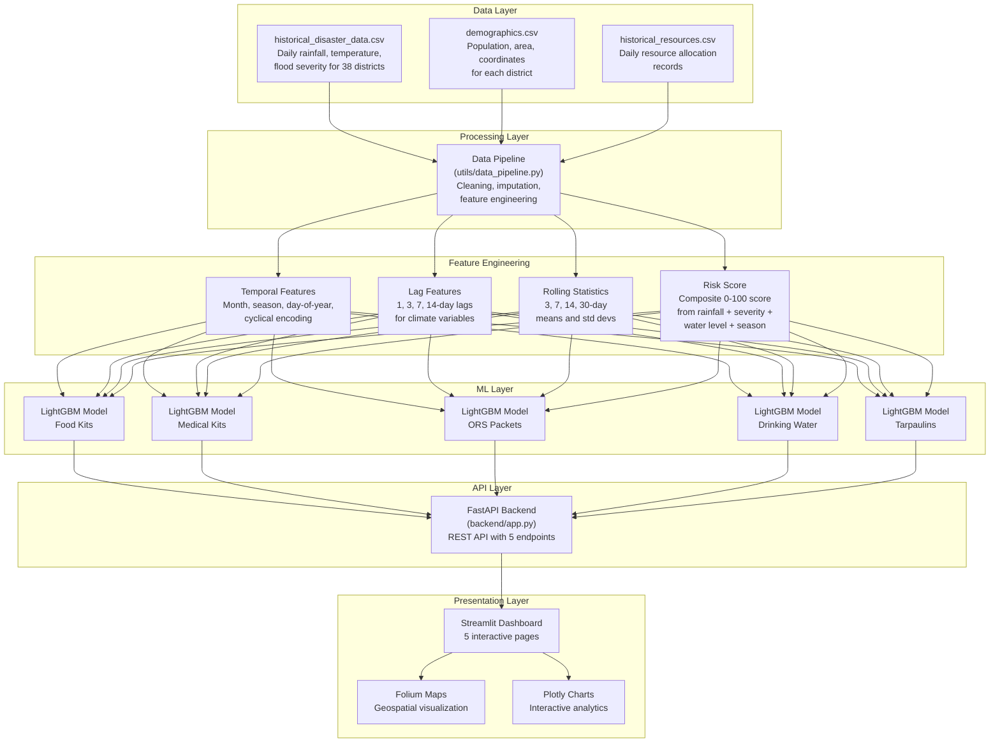
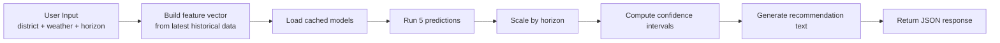
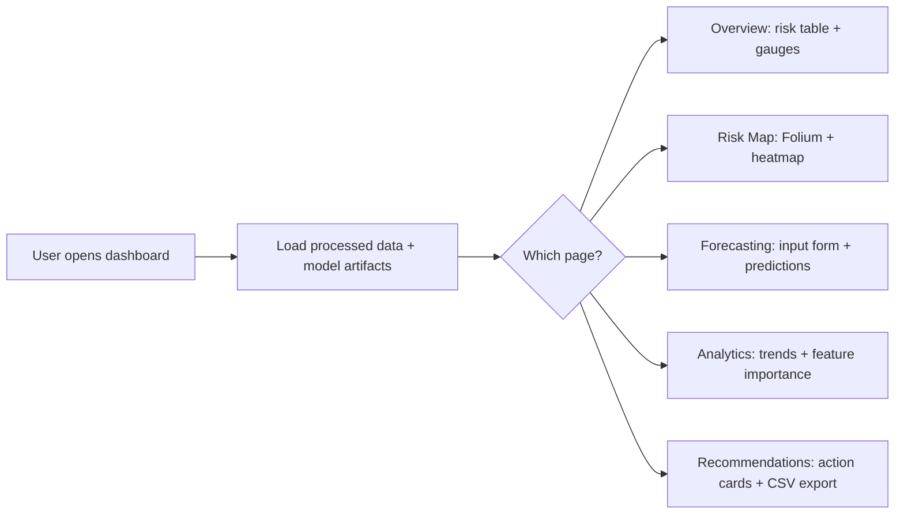
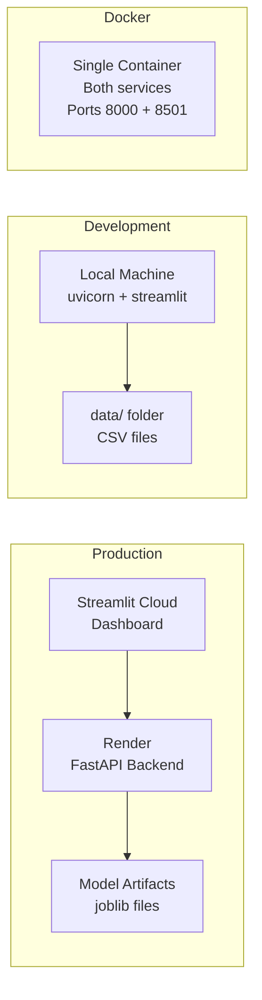

# Architecture Overview
## AI-Powered Disaster Resource Allocation Forecasting System

This document describes how the system is put together, what each piece does, and how data flows from raw CSVs all the way to the predictions a relief coordinator sees on their screen.

---

## High-Level Architecture

---

## Data Flow

The system processes data in three distinct phases:

### Phase 1: Batch Pipeline (runs once, or periodically)

```mermaid
flowchart LR
    A[Raw CSVs] --> B[Clean & Impute]
    B --> C[Merge on district + date]
    C --> D[Add temporal features]
    D --> E[Add lag features]
    E --> F[Add rolling stats]
    F --> G[Compute risk scores]
    G --> H[features.csv]
    H --> I[Train 5 LightGBM models]
    I --> J[Save .joblib + metrics.json]
```

### Phase 2: Real-time Prediction (on each API request)

### Phase 3: Visualization (Streamlit dashboard)

---

## Component Details

### Data Pipeline (`utils/data_pipeline.py`)

This is where the heavy lifting happens. The pipeline takes three raw CSV files and produces a single feature-rich dataset with 80+ columns. Here's what it does:

- **Cleaning**: Forward-fills missing values within each district's time series, then fills any remaining gaps with column medians. This handles the reality that some districts have patchy reporting.
- **Temporal features**: Extracts month, day-of-year, week number, and adds a binary monsoon flag. Also creates cyclical sin/cos encodings of the month so the model understands that December and January are close together.
- **Lag features**: For each climate variable (rainfall, temperature, humidity, flood severity, river level), creates 1-day, 3-day, 7-day, and 14-day lagged versions. This lets the model see "what happened last week" when predicting tomorrow.
- **Rolling features**: Computes 3, 7, 14, and 30-day rolling means and standard deviations. These capture trends and volatility.
- **Risk score**: A weighted composite of normalised rainfall (35%), flood severity (30%), river water level (25%), and monsoon flag (10%), scaled to 0-100.

### ML Models (`train.py`)

We train five independent LightGBM regressors, one per resource type. Why separate models instead of one multi-output model? Because each resource has different demand patterns — tarpaulin demand spikes sharply with severity while ORS demand correlates more with humidity and temperature.

Training uses a temporal split (80% train, 20% test) rather than random k-fold, because this is time-series data and random splits would leak future information into training.

### FastAPI Backend (`backend/`)

The API is intentionally simple. Five endpoints, no authentication, CORS wide open. The prediction service caches loaded models in memory so the first request is slow (model loading) but subsequent requests are fast.

The prediction flow:
1. Receive district + weather inputs
2. Look up the district's latest historical data for lag/rolling features
3. Combine with demographic data
4. Build a single-row feature vector matching the model's expected columns
5. Run all five models
6. Multiply daily predictions by forecast horizon
7. Add 15% confidence intervals
8. Generate a recommendation string
9. Return everything as JSON

### Streamlit Dashboard (`dashboard/`)

Built as a multi-page Streamlit app. Each page loads data independently (no shared state between pages except session state). The design uses a dark theme with gradient accents to look professional without being distracting.

Folium maps use CartoDB dark_matter tiles with circle markers sized by risk score and colored by risk level. A heatmap layer shows risk concentration across the state.

---

## Technology Choices and Why

| Choice | Reasoning |
|--------|-----------|
| **LightGBM** over XGBoost or Prophet | Faster training on tabular data, handles missing values natively, good with lag features. Prophet is better for pure time-series but our data is tabular with many features. |
| **FastAPI** over Flask or Django | Automatic OpenAPI docs, async support, Pydantic validation built in. For an API this simple, Flask would also work fine. |
| **Streamlit** over Dash or custom React | Fastest path to a working dashboard. The target users are NGO coordinators, not software engineers — Streamlit's simplicity is a feature. |
| **Folium** over Plotly maps | Better support for tile providers and marker customisation. Plotly maps are nice but Folium gives us more control over the CartoDB dark tiles and heatmap overlays. |
| **CSV files** over a database | The challenge spec requires no database. CSVs keep things simple and portable. For production scale, you'd want PostgreSQL. |

---

## Deployment Architecture

---

*This architecture document is part of the AI-Powered Disaster Resource Allocation Forecasting System.*
