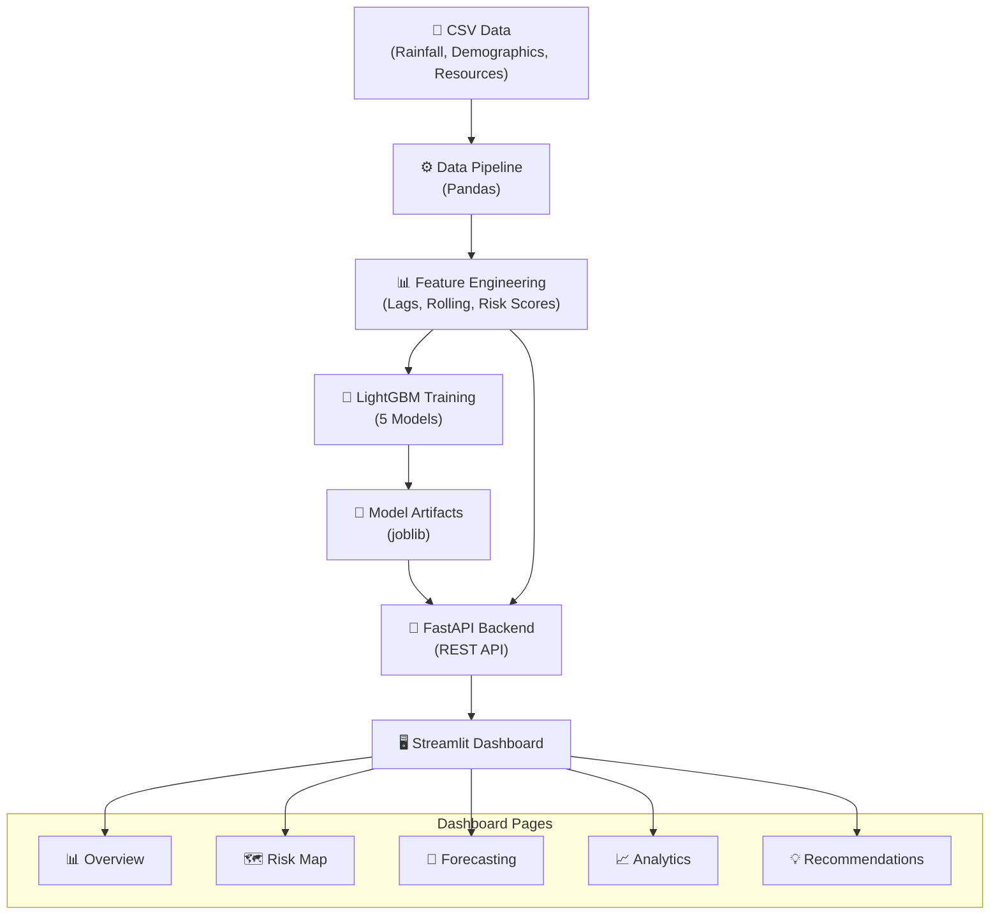

# 🌊 AI-Powered Disaster Resource Allocation Forecasting System

[](https://python.org)
[](https://fastapi.tiangolo.com)
[](https://streamlit.io)
[](https://lightgbm.readthedocs.io)

> Predict disaster relief resource requirements (food kits, medical kits, ORS packets, drinking water, tarpaulins) for **38 districts in Bihar** 7–30 days in advance using ML-powered forecasting.

---

## 📋 Table of Contents

- [Features](#-features)
- [Architecture](#-architecture)
- [Project Structure](#-project-structure)
- [Quick Start](#-quick-start)
- [API Documentation](#-api-documentation)
- [Dashboard Pages](#-dashboard-pages)
- [Model Details](#-model-details)
- [Deployment](#-deployment)
- [Testing](#-testing)
- [Tech Stack](#-tech-stack)

---

## ✨ Features

| Feature | Description |
|---------|-------------|
| 🔮 **Resource Forecasting** | Predict 5 resource types for 38 Bihar districts with 7–30 day horizons |
| 🗺️ **Interactive Risk Map** | Folium-based Bihar map with heatmaps and risk-colored markers |
| 📊 **Analytics Dashboard** | Historical trends, correlation matrices, feature importance plots |
| 💡 **Smart Recommendations** | Human-readable, district-specific pre-positioning recommendations |
| 🤖 **LightGBM Models** | One optimised model per resource type with temporal validation |
| 📈 **Explainability** | Feature importance, SHAP values, and confidence intervals |
| 🚀 **Production API** | FastAPI backend with auto-docs, CORS, and health checks |
| 🐳 **Docker Ready** | Single Dockerfile for containerised deployment |

---

## 🏗️ Architecture



---

## 📁 Project Structure

```
disaster_resource_forecasting/
│
├── backend/                    # FastAPI backend
│   ├── app.py                  # Application entry point
│   ├── routes/
│   │   └── api.py              # API route definitions
│   ├── services/
│   │   ├── prediction.py       # Prediction logic & model loading
│   │   └── explainability.py   # SHAP & feature importance
│   └── models/
│       └── schemas.py          # Pydantic request/response models
│
├── dashboard/                  # Streamlit frontend
│   ├── Home.py                 # Main entry point
│   ├── pages/
│   │   ├── 1_Overview.py       # System status & risk summary
│   │   ├── 2_Risk_Map.py       # Interactive Bihar map
│   │   ├── 3_Forecasting.py    # Resource demand predictions
│   │   ├── 4_Analytics.py      # Trends & model performance
│   │   └── 5_Recommendations.py # Actionable recommendations
│   └── components/
│       ├── charts.py           # Plotly chart components
│       └── maps.py             # Folium map components
│
├── data/
│   ├── sample/                 # Synthetic sample datasets
│   └── processed/              # Feature-engineered output
│
├── model_artifacts/            # Trained models & metrics
│
├── utils/
│   ├── data_pipeline.py        # ETL & feature engineering
│   ├── generate_data.py        # Synthetic data generator
│   └── logger.py               # Centralized logging
│
├── tests/
│   ├── test_api.py             # API endpoint tests
│   └── test_pipeline.py        # Data pipeline tests
│
├── train.py                    # Model training script
├── requirements.txt            # Python dependencies
├── Dockerfile                  # Container configuration
├── render.yaml                 # Render deployment config
├── .streamlit/config.toml      # Streamlit theme configuration
├── .env.example                # Environment variable template
└── README.md                   # This file
```

---

## 🚀 Quick Start

### Prerequisites

- Python 3.11+
- pip

### 1. Clone & Install

```bash
cd disaster_resource_forecasting
pip install -r requirements.txt
```

### 2. Generate Sample Data

```bash
python utils/generate_data.py
```

This creates 3 CSV files in `data/sample/`:
- `historical_disaster_data.csv` – 8 years of daily climate/flood data
- `demographics.csv` – Population, area, coordinates for 38 districts
- `historical_resources.csv` – Daily resource allocation records

### 3. Train Models

```bash
python train.py
```

This runs the full pipeline:
1. Loads and cleans data
2. Engineers 80+ features (lags, rolling averages, risk scores)
3. Trains 5 LightGBM models (one per resource type)
4. Saves models, metrics, and feature importances to `model_artifacts/`

### 4. Start the Backend

```bash
uvicorn backend.app:app --reload --port 8000
```

API docs available at: `http://localhost:8000/docs`

### 5. Start the Dashboard

```bash
streamlit run dashboard/Home.py
```

Dashboard available at: `http://localhost:8501`

---

## 📡 API Documentation

### Base URL: `http://localhost:8000/api/v1`

| Method | Endpoint | Description |
|--------|----------|-------------|
| `POST` | `/predict` | Generate resource predictions for a district |
| `GET` | `/districts` | List all 38 Bihar districts with demographics |
| `GET` | `/metrics` | Model evaluation metrics (MAE, RMSE, MAPE) |
| `GET` | `/feature-importance` | Feature importance scores |
| `GET` | `/health` | API health check |

### Example: POST /predict

```json
// Request
{
    "district": "Patna",
    "forecast_horizon_days": 7,
    "rainfall_mm": 150.0,
    "temperature_c": 32.0,
    "humidity_pct": 80.0,
    "flood_severity": 3,
    "river_water_level_m": 6.5
}

// Response
{
    "district": "Patna",
    "forecast_horizon_days": 7,
    "risk_score": 62.5,
    "risk_level": "High",
    "predictions": {
        "food_kits": 4500,
        "medical_kits": 2000,
        "ors_packets": 12000,
        "drinking_water_litres": 35000,
        "tarpaulins": 1200
    },
    "confidence_interval": {
        "food_kits": {"lower": 3825, "upper": 5175},
        ...
    },
    "recommendation": "Patna district has high flood risk. ..."
}
```

---

## 🖥️ Dashboard Pages

| Page | Description |
|------|-------------|
| 🏠 **Home** | System overview with navigation cards |
| 📊 **Overview** | Key metrics, risk distribution, top at-risk districts |
| 🗺️ **Risk Map** | Interactive Folium map with heatmap and filterable markers |
| 🔮 **Forecasting** | Input parameters → AI predictions with confidence intervals |
| 📈 **Analytics** | Historical trends, feature importance, model performance |
| 💡 **Recommendations** | Auto-generated actionable recommendations with CSV export |

---

## 🤖 Model Details

### Algorithm: LightGBM (Gradient Boosted Decision Trees)

- **Targets**: Food Kits, Medical Kits, ORS Packets, Drinking Water, Tarpaulins
- **Features**: 80+ engineered features including:
  - Temporal (month, season, day-of-year, cyclical encoding)
  - Lag features (1, 3, 7, 14-day lags)
  - Rolling statistics (3, 7, 14, 30-day means and std devs)
  - Composite risk score
  - Demographic data (population, vulnerability, area)
- **Validation**: Temporal train/test split (80/20)
- **Metrics**: MAE, RMSE, MAPE

### Hyperparameters

```python
{
    "objective": "regression",
    "boosting_type": "gbdt",
    "num_leaves": 63,
    "learning_rate": 0.05,
    "feature_fraction": 0.8,
    "bagging_fraction": 0.8,
    "n_estimators": 500,
    "early_stopping_rounds": 30,
}
```

---

## 🚢 Deployment

### Docker

```bash
docker build -t disaster-forecast .
docker run -p 8000:8000 -p 8501:8501 disaster-forecast
```

### Render (FastAPI Backend)

1. Push to GitHub
2. Connect repo to Render
3. It will use `render.yaml` automatically

### Streamlit Cloud (Dashboard)

1. Push to GitHub
2. Go to [share.streamlit.io](https://share.streamlit.io)
3. Point to `dashboard/Home.py`
4. Set Python version to 3.11

---

## 🧪 Testing

```bash
# Run all tests
pytest tests/ -v

# Run specific test file
pytest tests/test_api.py -v
pytest tests/test_pipeline.py -v
```

---

## 🛠️ Tech Stack

| Component | Technology |
|-----------|------------|
| **ML Model** | LightGBM |
| **Data Processing** | Pandas, NumPy, Scikit-learn |
| **Backend API** | FastAPI, Uvicorn, Pydantic |
| **Dashboard** | Streamlit, Plotly |
| **Geospatial** | GeoPandas, Folium |
| **Explainability** | SHAP |
| **Deployment** | Docker, Render, Streamlit Cloud |
| **Testing** | Pytest, HTTPX |

---

## 📄 License

This project is for educational and humanitarian purposes.

---

<div align="center">
    <strong>Built with ❤️ for Bihar Disaster Management</strong>
</div>
